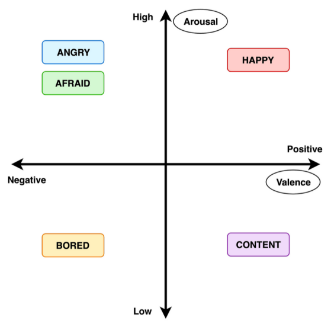

# Détection d'émotions dans la voix
Ce projet a été réalisé dans le cadre du cours d'Interaction Homme-Machines Évoluées (IHME), dispensé à l'INSA Rouen Normandie, par DOUET Marie, GRINDEL Brice, MARTIN Lucas et SOUVANNAVONG Elise.

Il se base notamment sur les synthèses bibliographiques suivantes :
- Reconnaissance d’émotions dans la voix, IMBERT Alexis et MARTIN Lucas, 21 novembre 2023
- Détection et synthèse (visuelle et sonore) d’émotions, LUYPAERT Pierre et SOUVANNAVONG Elise, 21 novembre 2023

## Manuel d'installation

1. Cloner le projet
2. Télécharger l'archive de ressources disponible [ici](https://ent.normandie-univ.fr/filex/get?k=Kw6BxBKPYXit7gKgpdi) comprenant la base de données des fichiers audios (RAVDESS) et le fichier `.jar` servant à la compilation du bot discord
3. Inscrire le token Discord du bot dans `src/bot/config.json`
4. Mettre le fichier JDA de l'archive ressource dans `jda/`
5. Mettre le contenu du dossier `data_samples` de l'archive ressource dans `assets/`
6. Dans un premier terminal, exécutez les commandes suivantes depuis la racine du projet :
```bash
javac src/bot/*.java -sourcepath src -classpath jda/JDA-5.0.0-beta.15-withDependencies.jar -d class
java -classpath class:jda/JDA-5.0.0-beta.15-withDependencies.jar bot.Main
```
7. Dans un second, exécutez ces commandes :
```bash
cd src/web-server
npm i
cd interface-web
npm i
npm run build
cd ..
npm start
```

8. Enfin, dans un troisième et dernier terminal, faîtes depuis la racine du projet :
```bash
python3 src/main.py
```

9. Connectez vous à un channel vocal de votre serveur Discord, sur lequel est invité le bot. Tapez `/join` dans un cannal de texte et commencez à parler.

10. Profitez de la reconnaissance à l'adresse indiquée par le bot ou sur `localhost:3002`

## Manuel utilisateur
En ayant suivi toutes les étapes du manuel d’installation, à chaque lancement de l’application il faudra: 
Lancer le bot Discord depuis la racine du projet :
```bash
java -classpath class:jda/JDA-5.0.0-beta.15-withDependencies.jar bot.Main
```
Lancer le script python depuis la racine également :
```bash
python3 src/main.py
```
Lancer finalement le serveur Node:
```bash
cd src/web-server
npm start
```

Ces trois commandes peuvent être finalement exécutées depuis un même terminal avec `&` entre chacune.

Pour accéder au benchmark des différents modèles d’apprentissage, vous pouvez ouvrir le fichier notebook jupyter dans `src/Benchmark_ML.ipynb`.

## Rapport
### Introduction
De nos jours, de nombreuses maladies, telles que l’autisme, entraînent des difficultés d’adaptation sociale pour les personnes qui en sont atteintes. En effet, ces maladies ont généralement un impact négatif sur leur quotient émotionnel, qui leur permet non seulement de ressentir des émotions mais également d’identifier celles de leurs interlocuteurs. Ainsi, ces maladies représentent un véritable handicap au quotidien, car elles entravent considérablement l’empathie et les aptitudes naturelles de communication de ces patients.

L’objectif de notre projet est de donc d'implémenter un détecteur d’émotion “en temps réel”, nommé Emoticall, afin d’aider ces personnes en facilitant l’identification des émotions exprimées par leurs interlocuteurs. 
Nous avons choisi de travailler sur l’identification des sept émotions universelles d’après les travaux de Paul Ekman : 
- la Colère
- la Joie
- le Dégoût
- la Tristesse
- la Peur
- la Surprise
- le Neutre

La détection d’émotion lors d’un appel vocal est plus complexe qu’en personne, car elle dépend principalement des modulations vocales et des choix lexicaux, sans les indices visuels. C’est pour cela que nous avons décidé de centrer notre projet sur la voix uniquement. De plus, dans l’idée que notre projet soit utilisable par le plus grand nombre possible, nous avons décidé de ne pas prêter attention à la langue (et donc aux mots) utilisée par les interlocuteurs, ainsi notre modèle n'analyse que l’intonation vocale et non les phrases à proprement parler.

La captation audio se fera à l’aide d’un bot discord participant à la discussion sur un channel vocal, et l’émotion prédite sera transmise à l’utilisateur grâce à une interface web. 

### Spécifications
Pour ce faire, nous avons fixé des spécifications à notre projet : 
- Sur la base d’une validation humaine, l’objectif est d’atteindre les 70% d’émotions correctement identifiées, avec un seuil critique fixé à 60%.
- On impose une sortie visuelle catégorielle pour l’affichage de l’émotion.
- Entre la réception de l’audio émis par le bot discord et l’affichage de l’émotion prédite sur la page web, l’objectif est de rester sous les 500 millisecondes de délai, en admettant un seuil critique à 1 seconde.
- Pour être le plus proche possible du “temps réel” et faciliter l’expérience utilisateur, l’entrée du flux audio doit être continue.

### Conception
#### Benchmark et Modèle d’apprentissage
Pour répondre aux spécifications du projet nous avons choisis d’implémenter un bot discord pour recueillir un flux audio via la fonction appel de discord. Ce bot, grâce à un modèle d’apprentissage automatique déjà entraîné, détecte l’émotion puis envoie l’information à une interface web pour ensuite l’afficher sous la forme choisie. 

Comme il serait trop coûteux d’analyser le flux en permanence mais que le modèle doit recevoir une quantité de données suffisante pour analyser l’émotion, nous avons choisis d’exporter l’information en fichier d’une durée de 4 secondes. La durée de 4 secondes a été choisie afin d’être au plus proche des données d'entraînement. 

Pour l'entraînement et le choix du modèle d’apprentissage, il fallait avant tout une base de données importante. Dans notre cas, une bonne base de donnée doit comporter les 7 émotions définies, être fiable (c'est-à-dire être sûre du label de l’émotion attribué), avoir des voix féminine et masculine, contenir une quantité de données suffisante, et être facile à exploiter. Heureusement nous avons trouvé plusieurs dataset correspondant à notre projet, comme RAVDESS [1] , SAVEE [2], ou bien encore IEMOCAP [3]. 
- L’utilisation de SAVEE a été abandonnée car le dataset était uniquement constitué de voix masculines.
- De même, l’utilisation d’IEMOCAP présentait plusieurs problèmes, les principaux étant que 25% des données n’avaient pas de label fiable car validé par moins de deux annotateurs, et que 25% des données n’avaient pas de label du tout. De plus, les enregistrements audio étaient réalisés par des amateurs. 

C’est pour cela que notre choix a été de travailler uniquement avec la base de données de RAVDESS. En effet, les données couvrent les sept émotions attendues, sont réalisées par des femmes et des hommes de manière égale et sont réalisées par des acteurs professionnels ce qui assure de la fiabilité de l’émotion exprimée. En outre les émotions sont simulées à deux intensités (normal et fort) et les acteurs ont tous les mêmes phrases possibles pour s’exprimer, cela assure des données standardisées. 

Par la suite, il a fallu faire plusieurs choix pour la partie intelligence artificielle. Tout d’abord nous avions pensé à utiliser plusieurs modèles pour analyser l’entrée audio et afficher l’émotion la plus reconnue. Par exemple, utiliser 3 modèles, et si deux détectent la même émotion, afficher cette émotion. Cependant, ceci n’a pas été la solution retenue. Nous avons en effet préféré utiliser un modèle unique, qui respecte notre valeur seuil de précision. Ce choix a été fait pour raccourcir les délais de traitement afin de respecter l’impression de temps réel, et rester dans nos valeurs seuils de latence. 

Pour la sélection de l'algorithme de machine learning, nous avons choisi de réaliser un benchmark approfondi afin d'évaluer la performance de différents modèles et de choisir celui qui correspond le mieux à nos critères. Pour rappel, nous avons un objectif de 70% de précision, et un seuil critique fixé à 60% de précision. Dans cette optique, nous avons évalué plusieurs algorithmes populaires tels que Support Vector Machines (SVM), Réseaux de Neurones Convolutif, Random Forest, Perceptron multicouche (MLP) et un SVM combiné à l’extraction de coefficient cepstral de prédiction linéaire en utilisant le dataset sélectionné précédemment. Le critère de sélection s'est basé sur des métriques telles que la précision et le rappel, afin d'obtenir une évaluation complète de la performance de chaque modèle. Après un examen des résultats du benchmark, nous avons choisi d’utiliser un réseau de neurones convolutif. Ce choix repose également sur des considérations de temps d'entraînement et de ressources computationnelles, contribuant ainsi à une implémentation efficace du système de détection émotionnelle.

#### Interface web
Concernant l’interface web, le choix s’est rapidement porté sur une application en page unique, sans système de connexion. En effet, l’interface n’étant pas au cœur de notre projet, il ne nous a pas paru nécessaire de développer une application plus complexe avec des fonctionnalités superflues. 

La restitution de l’émotion devait être compréhensible rapidement et par tous les utilisateurs, quel que soit leur âge ou leur nationalité. De plus, nos spécifications imposait une sortie visuelle catégorielle. Ainsi nous avons vite écarté notre première idée, à savoir la représentation de l’émotion sous forme d’un graphique en deux dimensions basé sur le modèle Valence-Arousal [4]. 



En effet, cette solution n’était pas réellement catégorielle, et ne permettait pas une identification au premier regard de l’émotion choisie. Nous avons donc porté notre choix sur une représentation de l’émotion prédite sous forme de smiley accompagné, par le nom de l’émotion. Ceci nous a permis de créer un set exhaustif de sept smileys et sept noms d’émotions pour les sept catégories à traiter. Nous avons choisi d’implémenter notre application en français et en anglais afin d’augmenter le public cible, et grâce aux smileys utilisés, l’âge de l’utilisateur ou sa langue maternelle n’ont pas d'importance car l’émotion est très facilement identifiable.

#### Schéma récapitulatif de la pipeline d’exécution


### Implémentation

#### Bot Discord
Pour prédire l’émotion de l’orateur, nous avions besoin d’extraire des données audio. Pour cela, nous avons réalisé un bot Discord en Java qui, connecté à un serveur et ayant rejoint un channel vocal via la commande `/join`, va écouter la personne qui l’a invoqué et enregistrer ses paroles toutes les 4 secondes puis va notifier, via un socket, le script python.

#### Benchmark des modèles d’apprentissage

Le dataset RAVDESS utilisé comporte 8 émotions :
 - la Colère
- la Joie
- le Dégoût
- la Tristesse
- la Peur
- la Surprise
- le Neutre
- le Calme

Cependant comme précisé dans la partie spécification, nous avons choisi de travailler uniquement avec les six émotions universelles ainsi que l’émotion neutre, il a donc fallu décider de comment traiter l’émotion “calme”. Plusieurs solutions étaient envisageables : répartir l’émotion calme dans d’autres émotions, retirer l'émotion des données, ou finalement étudier et afficher cette émotion dans notre projet. Dans notre cas, la meilleure solution devait ếtre fiable (toujours être certains du label de l’émotion), respecter la répartition des émotions, répondre à l’objectif principal de notre projet et être facile à implémenter. C’est pour cela que nous avons pris la décision de retirer la catégorie "calme" du jeu de données. Ce choix s'appuie sur plusieurs considérations. Premièrement, l'objectif de notre modèle est de détecter des émotions exprimées de manière dynamique et expressive, privilégiant ainsi les émotions qui peuvent être plus distinctes et informatrices dans un contexte donné. En retirant la catégorie "calme", nous simplifions la tâche du modèle en se concentrant sur des émotions qui sont potentiellement plus expressives et représentatives des réponses émotionnelles. Deuxièmement répartir nous même les extraits audio “calmes” aurait été une tâche extrêmement chronophage, de plus de par notre évaluation subjective des émotions nous aurions perdu en fiabilité et finalement nous risquions de déséquilibré les données en augmentant artificiellement une catégorie. Enfin, en alignant notre modèle sur les six émotions universelles de Paul Ekman, nous cherchons à construire un modèle axé sur des émotions de base, excluant ainsi des catégories qui pourraient être perçues comme moins universelles et plus contextuelles. 

Pour réaliser ce benchmark, nous avons sélectionné des modèles classiques, reconnus pour leur efficacité en s’inspirant des synthèses bibliographiques établies. 
Dans un premier temps, il a fallu charger la base de données et la prétraiter. En effet, s’agissant de fichiers audio .wav, nous devions extraire des caractéristiques afin de pouvoir entraîner nos modèles. Pour cela, nous avons, pour chaque fichier audio, récupéré les coefficients cepstraux de fréquence mel, les 12 classes de hauteurs ainsi que les fréquences du spectrogramme MEL. Ceci fait, nous avons pu obtenir nous données d’entrées et de sorties et les avons séparées en données de test et d'entraînement selon le rapport 25%-75% correspondant.
Nous nous sommes cependant séparés de l’émotion ‘calm’ qui ne correspondait pas à nos spécifications et avons fait le choix de ne pas attribuer ces données à d'autres classes mais simplement d’abandonner une partie des données d’entraînement pour garantir la précision de ces dernières.

Ensuite, nous avons implémenté les modèles en utilisant le module python `scikit-learn` pour les modèles SVM, MLPC, Random Forest et SVM+LPCC en utilisant une recherche des hyperparamètres automatique (fonction `GridSearchCV` du même module). Pour le dernier modèle, le CNN, nous l’avons implémenté depuis le module`tensorflow`. À noter que tous ces modèles ont appris avec des données prétraitées de la même façon, à l’exception du SVM+LPCC qui lui a bénéficié du prétraitement LPCC afin de vérifier la pertinence du prétraitement choisi par rapport au LPCC.

Nous avons ensuite exécutés ces modèles sur une validation croisées à 5 plis et utilisé la précision (sur les données de test) comme indicateur de performance.

|      nom      |    min   |  moyenne |    max   |    var   |
|:-------------:|:--------:|:--------:|:--------:|:--------:|
| SVM           | 0.582329 | 0.617564 | 0.645161 | 0.023393 |
| MLPC          | 0.634538 | 0.651373 | 0.662651 | 0.009523 |
| Random Forest | 0.497992 | 0.560445 | 0.604839 | 0.036276 |
|      CNN      | 0.649194 | 0.665060 | 0.689516 | 0.014175 |
|   SVM + LPCC  | 0.598394 | 0.629641 | 0.657258 | 0.021532 |

On remarque donc que le modèle CNN semble être le plus performant pour notre utilisation et c’est celui-ci qui va être implémenté.

#### Implémentations des modèles d’apprentissage

Deux scripts gèrent la partie d’apprentissage:
Le script `model.py` centralise l’implémentation du chargement et du déchargement (en archive) du modèle CNN (modèle choisi suite au benchmark) en mémoire, de l’extraction des caractéristiques ainsi qu’un fonction wrapper pour la prédiction de l’émotion.
Le fichier `main.py` cadence l'exécution en:
chargeant le modèle s’il une archive de ce dernier existe ou en crée une dans le cas échéant.
écoute sur le port du socket toute requête du bot discord et lance, pour chaque, la prédiction du modèle quant au fichier reçu dans le corps de cette dernière.
une fois l’émotion prédite et récupérée du modèle, le script envoie une requête POST au serveur Node.js sur la route `/emotion` afin de changer la valeur de l’émotion actuelle

#### Interface web
Afin d’afficher l’émotion de manière plus intuitive, nous avons choisi de la représenter sur une interface web. Pour cela, un serveur Node.js faisant office de backend permet le rendu du frontend (React) et la gestion de l’émotion prédite (affectation à une variable globale). Concernant cette deuxième partie, le script python envoie une requête POST sur la route `/emotion` afin de changer l’émotion actuelle et cette dernière est récupérée par le frontend par une requête GET sur cette même route toutes les 4 secondes (durée des enregistrements).

Nous avons en effet fait le choix d’utiliser React afin d’implémenter notre interface web car nous maîtrisions déjà en partie cette bibliothèque Javascript. De plus, React est pensé pour permettre aux développeurs de démarrer rapidement leur projet, est particulièrement efficace pour les applications mono-page, et permet d’associer une librairie de composants afin de simplifier et d’augmenter la lisibilité du code. Pour ce faire, nous avons choisi la librairie Chakra-UI.

Enfin pour implémenter le module de traduction, nous avons choisi d’utiliser le framework i18next, créé spécifiquement pour s’intégrer avec les frameworks React, Angular et Vue.js. Il était donc tout indiqué dans le cadre de notre projet. Ce module permet de gérer plusieurs langues grâce à un système de clés et de fichiers json répertoriant les différentes traductions. 


## Vidéo de démonstration

Une vidéo de démonstration est disponible [ici](https://ent.normandie-univ.fr/filex/get?k=5DguAoOjRRpJ4ocwcMJ)

## Conclusion et Ouverture
En reprenant les spécifications : 
- Atteindre les 70% d’émotions correctement identifiées, seuil critique fixé à 60% : Sur les données de test, nous atteignons les 69% de précisions, on peut donc considérer cet objectif comme atteint. Cependant, cela ne se ressent pas dans la réalité : en effet notre projet semble associer à de trop nombreux extraits audios l'émotion "peur", le résultat est donc mitigé.
- Sortie visuelle catégorielle : Cet objectif est amplement réalisé grâce à l'affichage par smiley, le nom de l'émotion venant en complément.
- Rester sous les 500 millisecondes de délai, seuil critique à 1 seconde : Le traitement de l'information et la prédiction de l'émotion tournent sous les 100 millisecondes (cf. les logs), toutefois les requêtes de l'interface web n'ont lieu que toutes les 4 secondes. Ainsi notre projet admet un délai allant jusqu'à 4 secondes, durée maximum de la désynchronisation entre l'interface web et l'envoi du flux audio.
- Flux audio continu : Comme dit précédemment, l'envoi, la réception et le traitement du fichier audio ainsi que la prédiction de l'émotion prennent au total moins de 100 millisecondes, on peut donc considérer qu'il s'agit bien de flux continu.

Pour améliorer notre projet et remplir l'ensemble des spécifications que nous avions établies, plusieurs pistes d'améliorations s'offrent à nous : 
- Tout d'abord, il pourrait être judicieux de'entraîner le modèle avec des données en plus grande quantité et plus variées, qui se rapprocheraient plus de notre contexte (un appel vocal).
- Concernant le problème de latence, il faudrait passer le délai maximum des 4 secondes sous la barre des 1 secondes en améliorant la communication entre le script python et le serveur node. Une piste serait de notifier l'application frontend lorsqu'une requête POST a été effectuée et que la variable globale a été mise à jour.
- Afin d'avoir plus de pertinence sur les émotions prédites, le modèle pourrait être étoffé en se basant non seulement sur l'intonation de la voix, mais aussi sur les mots et la language utilisé.


## Sources
[1] - https://www.kaggle.com/datasets/uwrfkaggler/ravdess-emotional-speech-audio

[2] - https://www.kaggle.com/datasets/ejlok1/surrey-audiovisual-expressed-emotion-savee

[3] - https://www.kaggle.com/datasets/samuelsamsudinng/iemocap-emotion-speech-database?rvi=1

[4] - Synthèse bibliographique, Alexis IMBERT & Lucas MARTIN, 21 novembre 2023
